

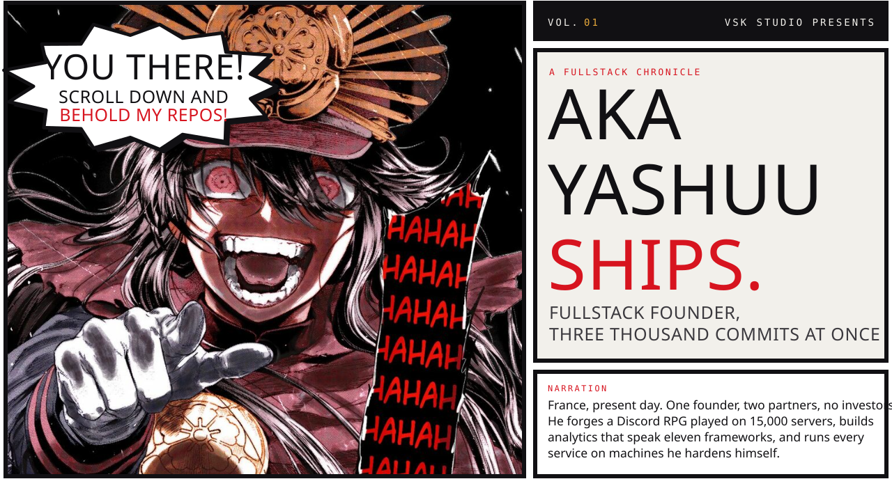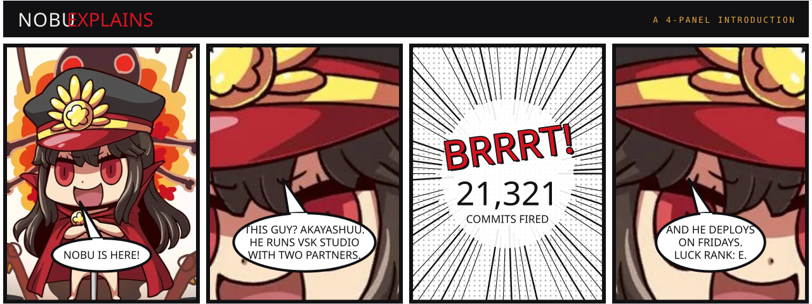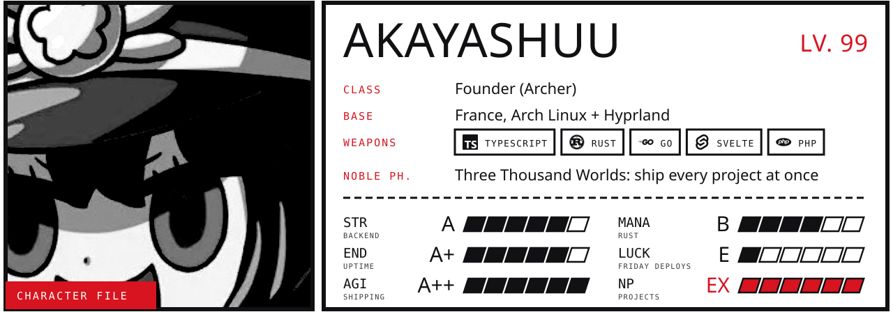<a href="https://vskstudio.fr">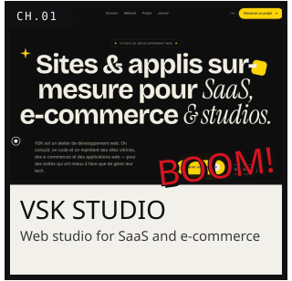</a><a href="https://taktlytics.com">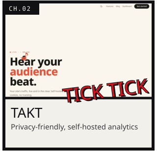</a><a href="https://naht.dev">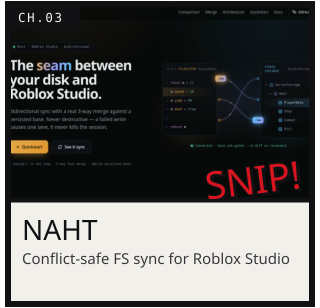</a><a href="https://ender.gg">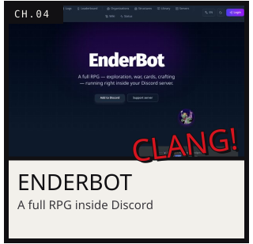</a><a href="https://github.com/Herrscherd/herrscher">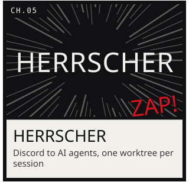</a><a href="https://ganyu.fr">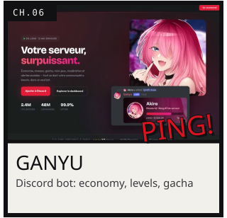</a><a href="https://github.com/vskstudio">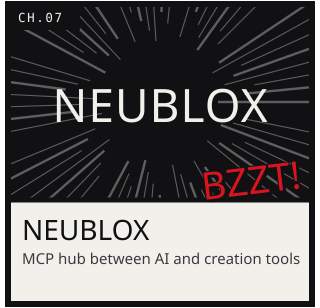</a><a href="https://karamon.fr">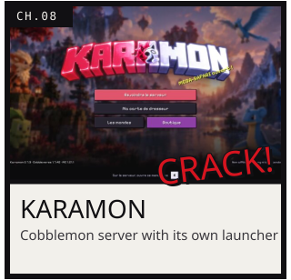</a><a href="https://github.com/Akayashuu?tab=repositories">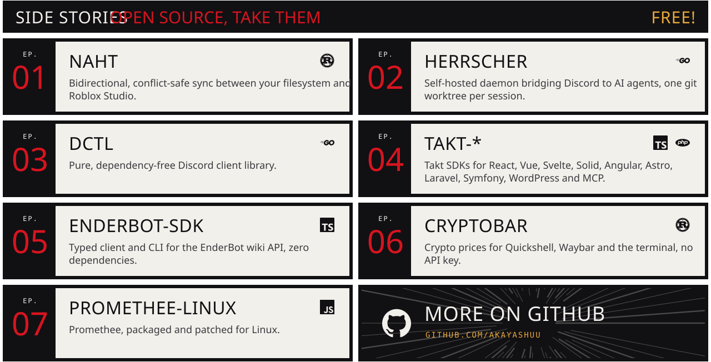</a>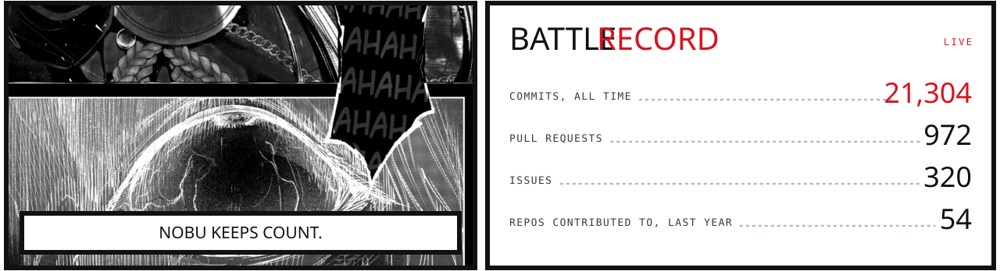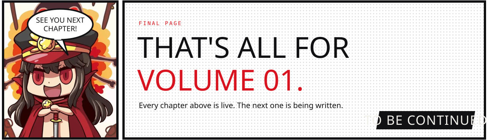<a href="https://sauvagel.xyz">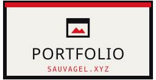</a><a href="https://x.com/Akayashuu">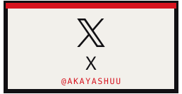</a>

Nobunaga art © TYPE-MOON / FGO PROJECT. Chibi from <i>Learn with Manga! FGO</i> by Riyo. Fan use, no affiliation.

